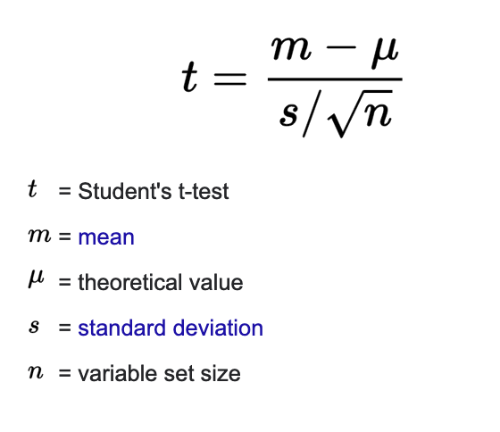

## Regression Vs. ANOVA:

- `Regression` is helpful to validate a hypothesis of whether the hypothesis made is correct or not.

- `ANOVA` is not used to make a prediction or estimate but to understand the relations between the set of variables.
 

###### EXAMPLES:

  - Regression:

  1. A paint company uses one of the derivatives of crude solvent & monomers as its raw material. Running a regression analysis between the price of that raw material and the price of Brent crude prices is helpful.
 
  2. In any business decision in order to validate a hypothesis that a particular action will lead to the increase in the profitability of a division can be validated based on the result of the regression between the dependent and independent variables.

  - ANOVA:

  1. Studying the series of marks of students from different colleges in order to try to find out whether one student from one school is better than the other.

  2. Do two separate research team is researching different products not related to each other. ANOVA will help to find which one is providing better results.

* **Main Differences:**

*|Regression|ANOVA
--|----------|-----
Definition:|is a very effective statistical method to establish the relationship between sets of variables.|is the short form of analysis of variance.It involves group not directly related to each other in order to find out whether there exist any common means.
Nature of Variables:|is applied to independent variables or fixed ones.|is applied to variables which are random in nature.
Types:|is mainly used in two forms, linear and multiple.|The three popular types of ANOVA are a random effect, fixed effect , and mixed effect.
Errors:|Residuals (SSE)|SSE, SSR, SSTO

**For more details see** [This](https://www.wallstreetmojo.com/regression-vs-anova/) link.

# Regression:

## Parameters:

b0 ~

b1 ~
 
 

* Tests for checking if there is a linear relationship between x and y:

  - **A) H0 : β1 =c**

    **H1 : β1 is not c**

  1. Reject H0 if t*>t((1 – α)/2 ; n-2)

  2. Reject H0 if c is not in the two-sided 100((1 – α))% CI for β1.

     `b1 +/- t((1 – α/2) ; n-2)*S{b1}`

  3. Reject H0 if p-value< α .

     (p-value= 2P[T>|t*|])

  - **B) H0 : β1 >= c**

    **H1 : β1 < c**

1. Reject H0 if t* < t((1 – α) ; n-2)

2. Reject H0 if c is not in the upper-bound 100((1 – α))% CI for β1.

`( -∞,b1 + t((1 – α) ; n-2)*S{b1})`

3. Reject H0 if p-value< α .

(p-value= 2P[T<t*])

Â
  - **C) H0 : β1 <= c**

    **H1 : β1 > c**

1. Reject H0 if t* > t((1 – α) ; n-2)

2. Reject H0 if c is not in the lower-bound 100((1 – α))% CI for β1.

   `(b1 - t((1 – α) ; n-2)*S{b1} , ∞)`

3. Reject H0 if p-value< α .

   (p-value= $2P[T>t*]$ )

# **ANOVA:**

Errors|Formula|DF(Degree of Freedom)
----|----|----
SSR | $\sum\limits_{i=1}^{n} (y_i-f(x_i))^2$ | 1
SSE | $Xni=1(yi − yˆi)2$ | n-2
SSTO | * | n-1
